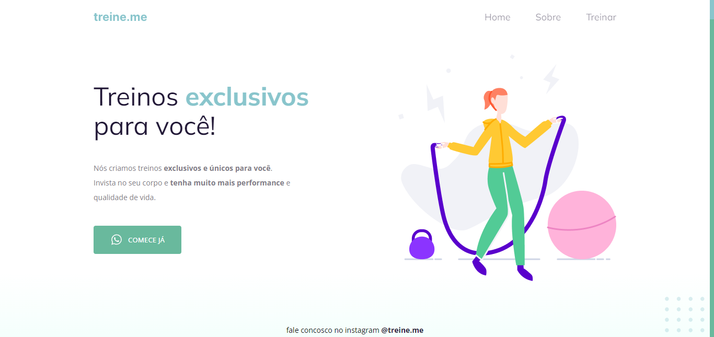

  

## 🖥️ Projeto
Esse projeto foi proposto em uma desafio para resolver os bugs presentes no código, onde tinham tags fora de posição valores alterados tanto no HTML quanto no CSS.

## 🚀 Tecnologias
Foi desenvolvido esse projeto no programa Explorer da Rocketseat no stage 02.

- HTML
- CSS
- GIT
- GITHUB
- FIGMA

## 👁 View
Aqui você pode visualizar o layout do projeto
<a 
  href="https://www.figma.com/file/eOa762zuNUD2DQ9fUKVVMK/Explorer---Projeto-01-(Copy)?type=design&node-id=0%3A1&t=GRDOWStd5cUjNWtw-1" target="_blank">clique aqui</a>
